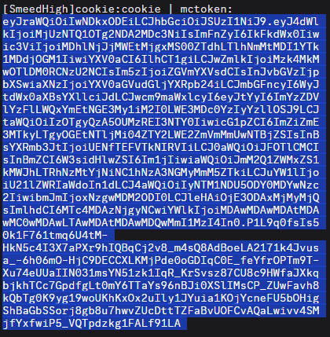
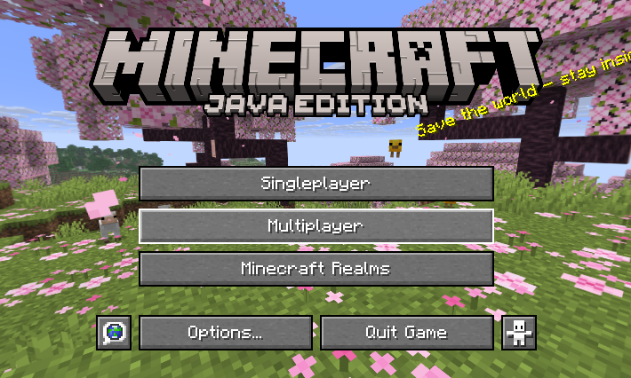
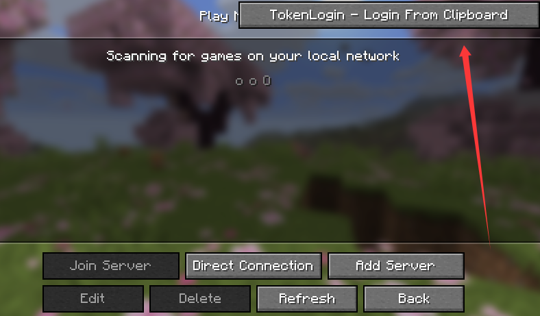

# TokenLogin

**中文** | **English**

---

## 中文

一个简单实用的 Minecraft Fabric Mod，让你可以通过复制 Access Token 一键登录。

### 功能特点

- 一键从剪贴板读取 Token 并登录
- 支持 Minecraft 26.1.2
- 操作极其简单，无需复杂配置

### 使用方法

使用本模组非常简单，只需要三步：

#### 第一步：复制你的 Token

将你的 Minecraft Access Token 复制到剪贴板。

#### 第二步：打开多人游戏界面

进入 Minecraft，点击「多人游戏」进入服务器列表界面。

#### 第三步：点击验证按钮

在多人游戏界面右上角，点击 **「TokenLogin - Login From Clipboard」** 按钮。

完成！模组会自动读取剪贴板中的 Token 并为你登录。

---

## English

A simple and practical Minecraft Fabric mod that allows you to log in with a single click by copying your Access Token.

### Features

- One-click login by reading the token from your clipboard
- Supports Minecraft 26.1.2
- Extremely simple to use, no complicated setup required

### How to Use

Using this mod is very simple — just follow these three steps:

#### Step 1: Copy Your Token

Copy your Minecraft Access Token to the clipboard.

#### Step 2: Open the Multiplayer Screen

Launch Minecraft and click **Multiplayer** to enter the server list screen.

#### Step 3: Click the Verify Button

In the top-right corner of the Multiplayer screen, click the **"TokenLogin - Login From Clipboard"** button.

Done! The mod will automatically read the token from your clipboard and log you in.

---

## 安装要求 | Requirements

- Minecraft 版本：**26.1.2**
- 需要安装 **Fabric Loader 0.19.2** 或更高版本
- 推荐搭配 **Fabric API** 使用

- Minecraft Version: **26.1.2**
- Requires **Fabric Loader 0.19.2** or higher
- **Fabric API** is recommended

## 安装方法 | Installation

1. 下载最新版本的 `tokenlogin-0.0.1.jar`
2. 将 jar 文件放入 Minecraft 的 `mods` 文件夹中
3. 启动游戏即可使用

1. Download the latest `tokenlogin-0.0.1.jar`
2. Place the jar file into your Minecraft `mods` folder
3. Launch the game and enjoy

## 注意事项 | Notes

- 请确保你复制的 Token 是有效的
- 该模组仅用于个人使用，请勿用于非法用途
- 使用前建议备份你的游戏存档

- Please make sure the token you copied is valid
- This mod is for personal use only. Do not use it for illegal purposes
- It is recommended to back up your game saves before use

## 作者 | Author

- KCl

---

如果遇到问题或有功能建议，欢迎在 GitHub 提出 Issue。

If you encounter any issues or have feature suggestions, feel free to open an Issue on GitHub.